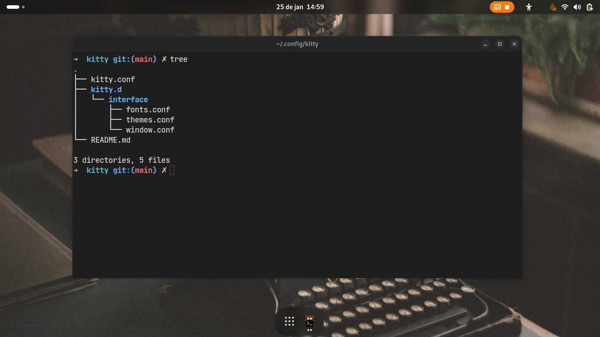

---

---

### My Kitty Terminal Configuration

This is my **personal** configuration for the Kitty Terminal, designed to integrate seamlessly with **GNOME**. I chose Kitty for its high customization capabilities and because I wasn't satisfied with the GNOME Terminal's direction. Also... *I am an anime boy :3* 🎌  

My setup is inspired by the **Adwaita** and **GTK4** aesthetic, ensuring a clean integration with **GNOME Shell**. It has been tested on **Fedora** running **Wayland**, **GNOME 47**, and GTK4.

---

### Project Structure

After cloning the repository, you'll find the following structure:

```
.
├── kitty.conf                # Main Kitty configuration
├── assets                    # Optional, you can delete
│   └── kitty.png
├── kitty.d                   # Additional configurations organized by theme
│   └── interface
│       ├── fonts.conf        # Font settings
│       ├── themes.conf       # Color palette and themes
│       └── window.conf       # Window and layout configurations
└── README.md                 # Project documentation
```

This modular organization makes it easy to customize specific aspects, such as fonts, colors, and layouts.

---

### Requirements

1. **Install Kitty**  
   Download directly from the [official Kitty website](https://sw.kovidgoyal.net/kitty/) or use your distribution's package manager. For example, on Fedora:  
   ```bash
   sudo dnf install kitty
   ```

2. **Install the JetBrains Mono Font**  
   Download and install [JetBrains Mono](https://www.jetbrains.com/lp/mono/) on your system. This font is ideal for developers, offering excellent readability and ligature support.

---

### Notes

- **Personal Configuration:**  
  This repository reflects my personal preferences. If you're a Kitty user looking for an elegant and highly customizable coding editor, I recommend my Neovim configurations, designed to integrate perfectly with this Kitty setup. Check the repository:  
  👉 [GOLD3NMOON's Neovim Configurations](https://github.com/GOLD3NMOON/my-neovim-config)  

- **Compatibility:**  
  While designed for **GNOME**, this configuration may work in other environments. Adjust as needed.

---

### Contact

Questions or suggestions? Find my social links on my GitHub profile:  
👉 [GOLD3NMOON](https://github.com/GOLD3NMOON)
